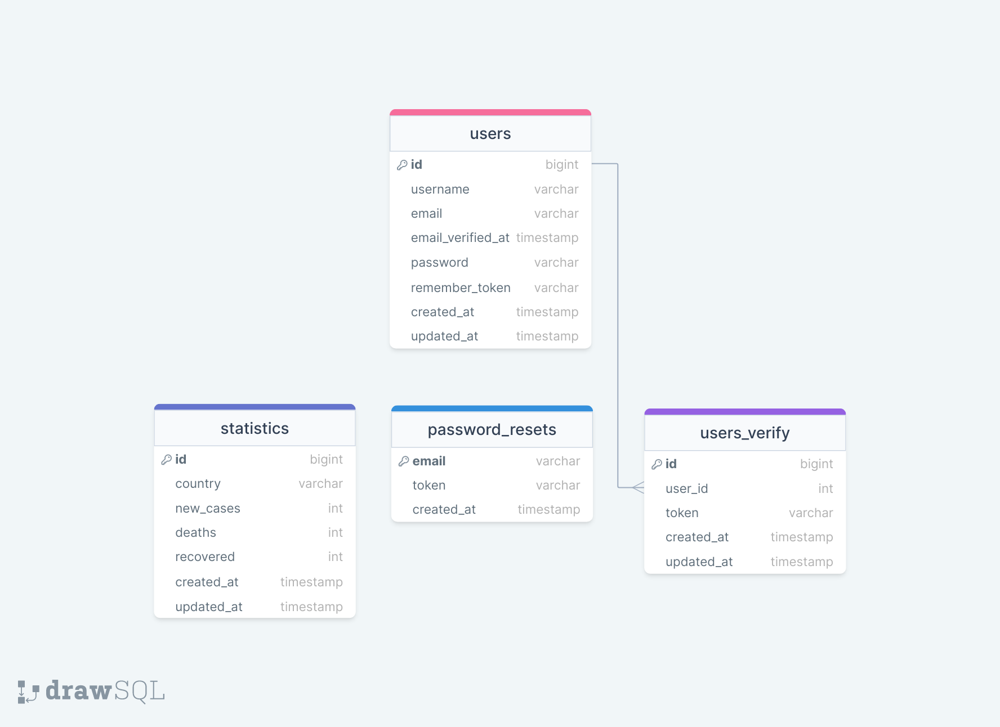

# Movie Quotes

In Corona Times App you can check statistics all over the world.
##
## Table of Contents
* [Prerequisites](#prerequisites)
* [Tech Stack](#tech-stack)
* [Getting Started](#getting-started)
* [Migrations](#migration)
* [Development](#development)
* [Mysql Diagram](#mysql-diagram)

##

## Prerequisites
* PHP@8.0.2
* MYSQL@8
* npm@8
* composer@2.4.3

##

## Tech Stack
* [Laravel@9.x](https://laravel.com/docs/9.x/releases) - back-end framework
* [Spatie Translatable](https://spatie.be/docs/laravel-translatable/v6/introduction) - package for translation
* [Tailwind Css@3.x](https://tailwindcss.com/docs/installation) - package for styling

##

## Getting Started
1. First of all you need to clone Corona Times repository from github:

```bash
 git clone https://github.com/RedberryInternship/coronatime-temo-jincharadze.git
```

2. Next step requires you to run composer install in order to install all the dependencies:

```bash
 composer install
```
3. After you have installed all the PHP dependencies, it's time to install all the JS dependencies:

```bash
 npm install
```
and also:

```bash 
npm run dev
```

4. Now we need to set our env file. Go to the root of your project and execute this command.
```bash
cp .env.example .env
```

5. Now you should provide .env file all the necessary environment variables:
```bash
DB_CONNECTION=mysql
DB_HOST=127.0.0.1
DB_PORT=3306
DB_DATABASE=*****
DB_USERNAME=*****
DB_PASSWORD=*****

MAIL_MAILER=smtp
MAIL_HOST=smtp.googlemail.com
MAIL_PORT=587
MAIL_USERNAME=*****
MAIL_PASSWORD=*****
MAIL_ENCRYPTION=tls
MAIL_FROM_NAME="CoronaTime"
```
##

## Migration
if you've completed getting started section, then just execute:
```bash
php artisan migrate
```
##

## Development
You can run Laravel's built-in development server by executing:
```bash
php artisan serve
```
when working on JS you may run:

```bash
npm run dev 
```

##

## Mysql Diagram
[View Diagram](https://drawsql.app/teams/redberry-33/diagrams/coronatime)



